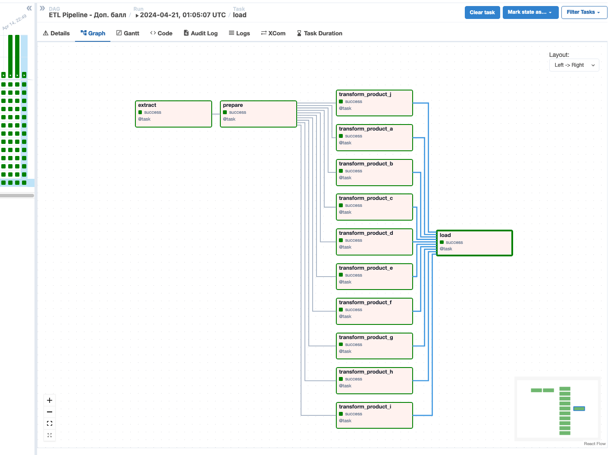

# Инжиниринг данных. Итоговый проект (PJ)

## Отработка навыков работы с Airflow 
### Краткое описание задачи:
В этом задании Вам предстоит создать DAG в Apache Airflow, 
который будет по расписанию запускать расчет витрины активности клиентов
по сумме и количеству их транзакций.

### Подробнее:
1. **Extract**. Необходимые данные хранятся в таблице profit_table.csv. 
Это таблица, в которой для каждого клиента по 10-ти продуктам собраны суммы и количества транзакций за каждый месяц.

    Что в названиях столбцов:
   - id - уникальный идентификатор клиента;
   - продукты обозначены буквами от a до j латинского алфавита;
   - сумма транзакций по соответствующим продуктам начинается с sum_…;
   - количество транзакций по соответствующим продуктам начинается с count_….
2. **Transform**. Суть витрины, которую необходимо собрать, таблица с флагами активностей клиентов по продуктам. 
Методика расчёта следующая: клиент считается активным по продукту за дату X, 
если в предыдущие 3 месяца (X, X-1 и X-2) у него были ненулевая сумма и количество транзакций по нему.
Но это всё за нас уже реализовали дата-саентисты. 
Их код для сбора итоговой витрины находится в функции transform в файле transform_script.py, 
его необходимо встроить в процесс.
3. **Load**. Итоговые результаты необходимо сохранять в csv-файл flags_activity.csv в той же директории, 
не перезатирая при этом данные старых расчётов в нём 
(обратите внимание, последнее не реализовано в примере кода от дата-саентиста, подумайте, 
какой параметр добавить при сохранении, чтобы всё прошло корректно).


    data/profit_table.csv - таблица с данными по транзакциям;
    data/transform_script.py - скрипт от дата-саентиста;
    data/flags_activity.csv - пример рассчитанного результата за 2024-03-01.

### Установка зависимостей для локальной разработки:
```bash
poetry install
```

### Поднятие Airflow локально:
```bash
docker-compose up
```

### Пример работающего DAG-а:


### Пример работающего DAG-а на доп баллы:
